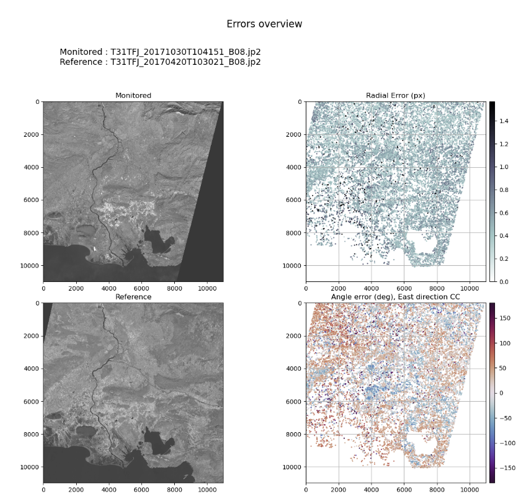

# The KARIOS Project


[](https://github.com/pre-commit/pre-commit)
[](https://github.com/psf/black)
[](https://pycqa.github.io/isort/)

KLT-based Algorithm for Registration of Images from Observing Systems (KARIOS)

## Introduction

In general, quality assessment process are fundamental to appreciate how well data fit for Earth Observation application purposes.
Those assessment dedicated to geometric accuracy are rarely opened to community. As consequence, it is always difficult to inter compare data based on the same process and it is always difficult to compare results based on harmonized mapping accuracy metrics.

To overcome this situation, thanks to funding of  ESA / EDAP [EDAP](https://earth.esa.int/eogateway/activities/edap) project, the KARIOS initiative has been promoted and a user tool is now available.

The KARIOS tool has been designed to analyse geometric deformations within optical / radar images.  For this purpose, the tool performs image matching and generate several key graphical presentations and compute accuracy statistics.

Image matching process does not follow traditional approach because it is based on feature point matching (corner). A [KLT](https://en.wikipedia.org/wiki/Kanade%E2%80%93Lucas%E2%80%93Tomasi_feature_tracker) implementation available in OpenCV library is used in KARIOS. Also, the Candidate point selection is done with GoodFeaturesToTrack function and matching is done  with calcOpticalFlowPyrLK function.

As show in the following picture, KARIOS makes KLT algorithm compatible with remote sensing images embedding suitable pre-processing (image filtering)  / post-processing (outlier filtering).


Furthermore, KARIOS analyses displacements between the two input image grids both in line and pixel direction outputing, providing user with the three following items:

- Geometric Error overview

- Geometric accuracy report

- Geometric distortion analysis report


The geometric accuracy report includes the following accuracy metrics, in both directions when relevant:
- Root Mean Square Error
- Minimum / Maximum Error
- Mean Error
- Standard deviation Error
- Circular Error @90 percentile

> The Circular Error (CE) at the 90% level confidence graphic is used for horizontal accuracy in image products.  
> This representation is relevant for image expressed within cartographic system grid.  
> Because, with the CE representation, it is straightforward to evaluate mapping accuracy, considering reference data with known accuracy.
>
> Rather, in case of images with no cartographic system grid, the CE graphic representation becomes less informative.  
> The CE graphic is still generated, and equally spaced sample data is assumed.  
> This hypothesis is not obvious, when details on image grids are unknown.

This tool is a Python application.

## Prerequisite

To run the tool you should have a dedicated conda environnement.

To do so, install [conda](https://docs.conda.io/projects/conda/en/stable/user-guide/install/index.html) or [miniconda](https://docs.conda.io/en/latest/miniconda.html), then run the following command to create the _karios_ conda env

```bash
conda env create -f environment.yml
```

Then activate the env:

```bash
conda activate karios
```

## Usage

KARIOS takes as mandatory inputs :
- monitored sensor image file
- reference sensor image file

> Input files shall contain only one layer of data, and the format shall recognized by gdal library.

Sample:

```bash
python karios/karios.py \
    /data/12SYH/LS9_OLIL2F_20220824T175017_N0403_R035_T12SYH_20230214T164934.SAFE/GRANULE/L2F_T12SYH_A000000_20220824T175017_LS9_R035/IMG_DATA/L2F_T12SYH_20220824T175017_LS9_R035_B04_10m.TIF \
    /data/References/GRI/T12SYH_20220514T175909_B04.jp2
```

### Outputs:

- csv file: list of key points and associated dx/dy deviations
- png file: visualisation of the deviations

### CLI options :

```
usage: karios.py [-h] [--mask MASK] [--conf CONF] [--out OUT] [--resume] [--generate-key-points-mask] [--input-pixel-size PIXEL_SIZE] [--no-log-file] [--debug]
                 [--log-file-path LOG_FILE_PATH]
                 mon ref

positional arguments:
  mon                   Path to the monitored sensor product
  ref                   Path to the reference sensor product

options:
  -h, --help            show this help message and exit
  --mask MASK           Path to the mask (default: None)
  --conf CONF           Configuration file path (default: /opt/karios/karios/configuration/processing_configuration.json)
  --out OUT             Output results folder path (default: /opt/karios/results)
  --resume              Do not run KLT matcher, only accuracy analysis and report generation (default: False)
  --generate-key-points-mask, -kpm
                        Generate a tiff mask based on KP from KTL (default: False)
  --generate-intermediate-product, -gip
                        Generate a two band tiff based on KP with band 1 dx and band 2 dy (default: False)
  --input-pixel-size PIXEL_SIZE, -pxs PIXEL_SIZE
                        Input image pixel size in meter. Ignored if image resolution can be read from input image (default: None)
  --no-log-file         Do not log in file (default: False)
  --debug, -d           Enable Debug mode (default: False)
  --log-file-path LOG_FILE_PATH
                        Log file path (default: /opt/karios/karios.log)
```

> Notice that default folder and file path are adapted to your KARIOS install folder.

## Configuration

The default configuration is located in [karios/configuration/processing_configuration.json](karios/configuration/processing_configuration.json)

### klt_matching parameters


- `xStart` : image X margin to apply (margin is skipped by the matcher)
- `tile_size` : tile size to process by KTL in the input image
- `laplacian_kernel_size` : Aperture size used to compute the second-derivative filters of Laplacian process
-
The following parameter allows to control how to find the most prominent corners in the
reference image, as described by the OpenCV documentation goodFeaturesToTrack, after applying Laplacian.

- `minDistance` : Minimum possible Euclidean distance between the returned corners.
- `blocksize` : Size of an average block for computing a derivative covariation matrix over each pixel neighbourhood.
- `maxCorners` : Maximum number of corners to extract. If there are more corners than are found, the strongest of them is returned.
`maxCorners = 0` implies that no limit on the maximum is set and all detected corners are returned.
- `qualityLevel` : Parameter characterizing the minimal accepted quality of image corners.
The parameter value is multiplied by the best corner quality measure.
The corners with the quality measure less than the product are rejected.
For example, if the best corner has the quality measure = 1500, and the qualityLevel=0.01,
then all the corners with the quality measure less than 15 are rejected.
- `matching_winsize` : size of the search window during matching corners in the reference and the monitored Laplacian images.
- `outliers_filtering` : whether to filter or not the outliers points found during the matching.

Refer to section [KLT param leverage](#klt-param-leverage) for details

### accuracy_analysis

- `confidence_threshold` : max score for points found by the matcher to use to compute statistics written in correl_res.txt.
If `None`, not applied.

### plot_configuration.overview

- `fig_size` : Size of the generated figure in inches
- `shift_colormap` : matplotlib color map name for the KP shift error scatter plot
- `shift_auto_axes_limit` : auto compute KP shift error colorbar scale
- `shift_axes_limit` : KP shift error colorbar maximum limit, N/A if `shift_auto_axes_limit` is `true`
- `theta_colormap` : matplotlib color map name for the KP theta error scatter plot

### plot_configuration.shift

- `fig_size` : Size of the generated figure in inches
- `scatter_colormap` : matplotlib color map name for the KP shift scatter plot
- `scatter_auto_limit` : auto compute KP shift scatter plot limit
- `scatter_min_limit` : KP shift scatter plot minimum limit, N/A if `scatter_auto_limit` is `true`
- `scatter_max_limit` : KP shift scatter plot maximum limit, N/A if `scatter_auto_limit` is `true`
- `histo_mean_bin_size` : KP shift histogram bin size (number of image row/col for the histogram bin)

### plot_configuration.ce
- `fig_size` : Height size of the generated figure in inches, width is 5/3 of the height
- `ce_scatter_colormap` : matplotlib color map name for the KP shift density scatter plot

## KLT param leverage

### maxCorners & tile_size

In order to have a lower memory usage during KLT process, it is possible to define a tile size to process for KLT.

For example, a tile_size of 10000 for an image having a size of 20000x20000 pixels will result of 4 tiles to process.

In this context, the KLT process will look in each tiles for `maxCorners`.

While an image of 20000x20000 pixels results of 4 equals tiles, an image of 20000x15000 pixels also result of 4 tiles, but with different size, two of 10000x10000 pixels and two of 10000x5000 pixels.

The consequence is that the density for matching point will not be the same each tiles, the bigger tiles will have a lower matching point than the smallest.

You may also consider that the image can content empty parts where KLT will not find any matching point. So tiles having a large empty parts will also results to a bigger matching point density.

In order to avoid density difference in the final result, you can define a `tile_size` largest than the image with an hight `maxCorners`, or a small `tile_size` and `maxCorners` in order to have tiles with almost same size.

For example, for image of 20000x15000 pixels, you should consider a `tile_size` of 20000 (1 tile), or 5000 (12 equal tiles)
