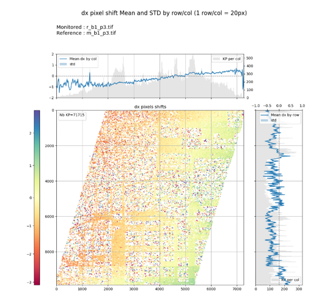

# The KARIOS Project

[](https://doi.org/10.5281/zenodo.10598329)

[](https://github.com/pre-commit/pre-commit)
[](https://github.com/psf/black)
[](https://pycqa.github.io/isort/)

KLT-based Algorithm for Registration of Images from Observing Systems (KARIOS)

## Introduction

In general, quality assessment processes are fundamental to appreciate how well data is fit for Earth Observation application purposes. Those assessments dedicated to geometric accuracy are rarely open to community. As a consequence, it is difficult to inter compare data based on the same processes and to compare results based on harmonized mapping accuracy metrics.

To overcome this situation, thanks to funding of ESA / EDAP [EDAP](https://earth.esa.int/eogateway/activities/edap) project, the KARIOS initiative has been launched and a user tool is now available.

The KARIOS tool has been designed to analyse geometric deformations within optical and radar images. For this purpose, the tool performs image matching and generate several key graphical representations and compute accuracy statistics.

Image matching process does not follow traditional approach because it is based on feature point matching (corner). A [KLT](https://en.wikipedia.org/wiki/Kanade%E2%80%93Lucas%E2%80%93Tomasi_feature_tracker) implementation available in OpenCV library is used in KARIOS. Also, the Candidate point selection is done with GoodFeaturesToTrack function and matching is done with calcOpticalFlowPyrLK function.

As shown in the following picture, KARIOS makes KLT algorithm compatible with remote sensing images embedding suitable pre-processing (image filtering) and post-processing (outlier filtering).


> As an optional and experimental feature, KARIOS has the capability to detect large shifts between images. If a large shift is detected, the monitored image is shifted according to the offsets found, and the KLT matching is applied
>
> To enable large shift detection, use `--enable-large-shift-detection` program argument.
>
> Please note that it could use lot of memory in case of large images such as Sentinel2 10 m bands, e.g. 11GB for band B04.

Furthermore, KARIOS analyses displacements between the two input image grids in both line (along-track) and pixel (across-track) directions, providing user with the three following items:

### Geometric Error overview


### Geometric accuracy report


### Geometric distortion analysis report



The geometric accuracy report includes the following accuracy metrics, in both directions when relevant:
- Root Mean Square Error
- Minimum / Maximum Error
- Mean Error
- Standard deviation Error
- Circular Error @90 percentile

> The Circular Error (CE) at the 90% level confidence graphic is used for horizontal accuracy in image products.  
> This representation is relevant for image expressed within cartographic system grid.  
> Because with the CE representation, it is straightforward to evaluate mapping accuracy, considering reference data with known accuracy.
>
> In case of images with no cartographic system grid, the CE graphic representation becomes less informative.  
> The CE graphic is still generated, and equally spaced sample data is assumed.  
> This hypothesis is not obvious, when details on image grids are unknown.

## Installation

### Prerequisites

This tool is a Python application for which you need a dedicated conda environnement.

- Python 3.12+
- [Conda](https://docs.conda.io/projects/conda/en/stable/user-guide/install/index.html) or [Miniconda](https://docs.conda.io/en/latest/miniconda.html). **We recommend Miniconda**.
- **libGL**: you need libGL for linux, depending on your distribution it can be libgl1-mesa-glx, mesa-libGL or another. Install it if you don't have it yet.

Get KARIOS:

```bash
git clone https://github.com/telespazio-tim/karios.git
```

Then goes to KARIOS dir:

```bash
cd karios
```

### Environment Setup

1. **Create the conda environment:**
   ```bash
   conda env create -f environment.yml
   ```

2. **Activate the environment:**
   ```bash
   conda activate karios
   ```

3. **Install KARIOS**

  For runtime :

   ```bash
   pip install .
   ```

   For development
   ```bash
   pip install -e .
   ```

   Karios is now installed in its conda envronement.

### Verify Installation

```bash
python -m karios --help
```

or

```bash
karios --help
```

## Usage

KARIOS can be used both as a command-line tool and as a Python library.

> Always activate the environment before using the command-line

```bash
conda activate karios
```

### Input Requirements and recommendations

KARIOS takes as inputs:
- **Monitored image** (mandatory): The image to analyze for shifts/changes
- **Reference image** (mandatory): The stable reference image for comparison
- **Mask file** (optional): Exclude pixels from matching (co-registered the monitored image, having byte values, 0 are excluded while 1 are considered has valid for process)
- **DEM file** (optional): Enable altitude-based analysis (compatible with reference image)

Requirements:

- Input images grids should be comparable. **The user should take care of data preparation**.  
  That means geo coded images must have the same footprint, same geotransform information (same cartographic projection, i.e. EPSG code) and same resolution.
- Image pixel resolution should also be square (same X, Y) and unit meter.

> **This is also applicable** to DEM and mask files for compatibility requirements.

Recommendation:

- The user shall carefully check the dynamic range of the monitored and reference images, because KARIOS converts these input data into integers.  
  For instance, providing float values between 0 and 1 will give very poor results. In that case, it is recommended to multiply the data by 100.
- Input files shall contain only one layer (band) of data, and the format shall be recognized by GDAL library.

## CLI Usage

> :warning: **All commands below suppose that the karios conda environment is activated**

### Command Structure

```bash
karios process MONITORED_IMAGE REFERENCE_IMAGE [MASK_FILE] [DEM_FILE] [OPTIONS]
```

### Arguments

- `MONITORED_IMAGE`: Path to the image to analyze for shifts/changes
- `REFERENCE_IMAGE`: Path to the stable reference image for comparison
- `MASK_FILE`: Optional mask file to exclude pixels from matching (use '-' to skip)
- `DEM_FILE`: Optional DEM file for altitude-based analysis

### Examples

#### Basic Processing

```bash
karios process monitored.tif reference.tif
```

#### With Mask

```bash
karios process monitored.tif reference.tif mask.tif
```

#### With Mask and DEM

```bash
karios process monitored.tif reference.tif mask.tif dem.tif \
  --dem-description "SRTM 30m resample to 10m"
```

#### DEM Only (No Mask)

```bash
karios process monitored.tif reference.tif - dem.tif \
  --dem-description "Copernicus DEM 30m"
```

#### Full Workflow with Options

```bash
karios process monitored.tif reference.tif mask.tif dem.tif \
  --out ./results \
  --generate-key-points-mask \
  --generate-intermediate-product \
  --title-prefix "MyAnalysis" \
  --dem-description "SRTM 30m" \
  --enable-large-shift-detection
```

#### Resume Previous Analysis

```bash
karios process monitored.tif reference.tif mask.tif dem.tif \
  --resume \
  --out ./existing_results
```

### CLI Options

#### Processing Options

| Option | Type | Description |
|--------|------|------------|
| `--conf` | FILE | Configuration file path. Default is the built-in configuration. [default: PWD/karios/configuration/processing_configuration.json] |
| `--resume` | Flag | Do not run KLT matcher, only accuracy analysis and report generation |
| `--input-pixel-size`, `-pxs` | FLOAT | Input image pixel size in meter. Ignored if image resolution can be read from input image |

#### Output Options

| Option | Type | Description |
|--------|------|------------|
| `--out` | PATH | Output results folder path [default: results] |
| `--title-prefix`, `-tp` | TEXT | Add prefix to title of generated output charts (limited to 26 characters) |
| `--generate-key-points-mask`, `-kpm` | FLAG | Generate a tiff mask based on KP from KTL |
| `--generate-intermediate-product`, `-gip` | FLAG | Generate a two-bands tiff based on KP with band 1 dx and band 2 dy |
| `--generate-kp-chips`, `-gkc` | FLAG | Generate chip images centered on key points of monitored and reference products |
| `--dem-description` | TEXT | DEM source name. Added in generated DEM plots (example: "COPERNICUS DEM resampled to 10m") |

#### Advanced Options

| Option | Type | Description |
|--------|------|------------|
| `--enable-large-shift-detection` | FLAG | Enable detection and correction of large pixel shifts |

#### Logging Options

| Option | Type | Description |
|--------|------|------------|
| `--debug`, `-d` | FLAG | Enable Debug mode |
| `--no-log-file` | FLAG | Do not log in file (not compatible with `--log-file-path`) |
| `--log-file-path` | PATH | Log file path [default: karios.log] |

## Library Usage

KARIOS can be used as a Python library in your own applications by providing an API that separates processing configuration from input data.

> :warning: **Your code should run in a Python environment having KARIOS dependencies installed**

### Prerequisite

Activate **your project conda environment**, then install KARIOS in this environment.

From the karios directory, run :

```bash
pip install .
```

Verify with

```bash
karios --help
```

### Basic Example

```python
from karios.api import KariosAPI, RuntimeConfiguration
from karios.core.configuration import ProcessingConfiguration

# Load processing configuration
processing_config = ProcessingConfiguration.from_file("config.json")

# Create runtime configuration (how to process)
runtime_config = RuntimeConfiguration(
    output_directory="./results",
    gen_kp_mask=True,
    gen_delta_raster=True,
    pixel_size=10.0,  # meters
    enable_large_shift_detection=False,
    generate_kp_chips=True,
)

# Initialize API
api = KariosAPI(processing_config, runtime_config)

# Process images (what to process) and generates plots
match_result, accuracy, reports = api.process(
    monitored_image_path="monitored.tif",
    reference_image_path="reference.tif",
    mask_file_path="mask.tif",        # Optional
    dem_file_path="dem.tif"           # Optional
)

# Access results
print(f"CE90: {accuracy.ce90:.3f}")
print(f"Mean shift X: {accuracy.mean_x:.3f} pixels")
print(f"Generated reports: {reports.overview_plot}")
```

### Batch Processing Example

```python
# Same configuration, multiple image pairs
image_pairs = [
    ("mon1.tif", "ref1.tif", "mask1.tif", "dem.tif"),
    ("mon2.tif", "ref2.tif", "mask2.tif", "dem.tif"),
    ("mon3.tif", "ref3.tif", None, "dem.tif")  # No mask for this pair
]

results = []
for monitored, reference, mask, dem in image_pairs:
    match, accuracy, reports = api.process(monitored, reference, mask, dem)
    results.append({
        'pair': (monitored, reference),
        'ce90': accuracy.ce90,
        'mean_shift': (accuracy.mean_x, accuracy.mean_y)
    })
    # ... other statements 

    # clean memory
    match = None
    accuracy = None
    reports = None
    monitored = None
    reference = None
    mask = None
    dem = None

    # or eventually use gc.collect()
```

### API Components

- **ProcessingConfiguration**: KLT parameters, accuracy thresholds, plot settings
- **RuntimeConfiguration**: Output settings, processing flags, optional descriptions
- **KariosAPI**: Main processing interface
- **MatchResult**: Key point matches and image metadata
- **AccuracyAnalysis**: Statistical metrics (CE90, RMSE, etc.)
- **ReportPaths**: Generated visualization and product file paths

## Configuration

KARIOS uses two types of configurations:

### Processing Configuration

The processing configuration defines algorithm parameters and is loaded from JSON files. The default configuration is located in [karios/configuration/processing_configuration.json](karios/configuration/processing_configuration.json).

This configuration includes:
- **KLT matching parameters**: Corner detection, window sizes, quality thresholds
- **Accuracy analysis settings**: Confidence thresholds for statistical calculations  
- **Plot configurations**: Figure sizes, color maps, axis limits
- **Large shift detection**: Bias correction thresholds

### Runtime Configuration (API)

The runtime configuration defines how processing should be performed and where outputs should be saved. It can be created programmatically when using KARIOS as a library:

```python
runtime_config = RuntimeConfiguration(
    output_directory="./results",
    pixel_size=10.0,              # Optional pixel size override
    title_prefix="MyAnalysis",    # Optional chart title prefix
    gen_kp_mask=True,             # Generate key point mask
    gen_delta_raster=True,        # Generate displacement raster
    generate_kp_chips=True,      # Enable chip generation
    dem_description="SRTM 30m",   # Optional DEM description for plots
    enable_large_shift_detection=False
)
```

When using the CLI, runtime configuration is automatically created from command-line arguments.

### Parameter Details

#### `processing_configuration.shift_image_processing` (Large Shift Matching processing parameters)
- `bias_correction_min_threshold`: Pixel threshold for applying large shift correction

#### `processing_configuration.klt_matching` (Matching processing parameters)
- `xStart`: X margin to skip during matching
- `tile_size`: Tile size for memory-efficient processing
- `laplacian_kernel_size`: Aperture size for Laplacian filtering

The following parameter allows to control how to find the most prominent corners in the
reference image, as described by the OpenCV documentation goodFeaturesToTrack, after applying Laplacian.

- `minDistance`: Minimum distance between detected corners
- `blocksize`: Block size for derivative computation
- `maxCorners`: Maximum corners to extract per tile. `0` implies that no limit on the maximum is set and all detected corners are returned.
- `qualityLevel`: Minimum corner quality threshold
- `matching_winsize`: Search window size during matching
- `outliers_filtering`: Enable/disable outlier filtering

Refer to section [KLT param leverage](#klt-param-leverage) for details

#### `processing_configuration.accuracy_analysis`
- `confidence_threshold`: Minimum confidence score for statistical analysis. If `None`, not applied.

Plot configuration parameters for `overview`, `shift`, `dem`, and `ce` plots control figure sizes, color maps, and axis limits.

#### `plot_configuration.overview` (overview plot parameters)

- `fig_size` : Size of the generated figure in inches
- `shift_colormap` : matplotlib color map name for the KP shift error scatter plot
- `shift_auto_axes_limit` : auto compute KP shift error colorbar scale
- `shift_axes_limit` : KP shift error colorbar maximum limit, N/A if `shift_auto_axes_limit` is `true`
- `theta_colormap` : matplotlib color map name for the KP theta error scatter plot

#### `plot_configuration.shift` (shift by row/col group plot parameters)

- `fig_size` : Size of the generated figure in inches
- `scatter_colormap` : matplotlib color map name for the KP shift scatter plot
- `scatter_auto_limit` : auto compute KP shift scatter plot limit
- `scatter_min_limit` : KP shift scatter plot minimum limit, N/A if `scatter_auto_limit` is `true`
- `scatter_max_limit` : KP shift scatter plot maximum limit, N/A if `scatter_auto_limit` is `true`
- `histo_mean_bin_size` : KP shift histogram bin size (number of image row/col for the histogram bin)

#### `plot_configuration.dem` (shift by altitude group plot parameters)

- `fig_size` : Size of the generated figure in inches
- `show_fliers` : draw fliers of box plot
- `histo_mean_bin_size`: KP altitude histogram bin size (altitude ranges size)

#### `plot_configuration.ce` (Circular error plot parameters)
- `fig_size` : Height size of the generated figure in inches, width is 5/3 of the height
- `ce_scatter_colormap` : matplotlib color map name for the KP shift density scatter plot

### Outputs

KARIOS generates several types of outputs:

#### Statistical Files

- **CSV file**: Key points with dx/dy deviations and confidence scores (see [CSV Output section](#csv-output))
- **correl_res.txt**: Summary statistics (RMSE, CE90, etc.)

#### Visualizations

- **01_overview.png**: Error distribution overview with image thumbnails
- **02_dx.png**: X-direction displacement analysis by row/column
- **03_dy.png**: Y-direction displacement analysis by row/column  
- **04_ce.png**: Circular error analysis with statistical summaries
- **dem_*.png**: DEM-based altitude analysis (if DEM provided)

#### Products (Optional)

- **kp_mask.tif**: Binary mask of key point locations (if `--generate-key-points-mask`)
- **kp_delta.tif**: Two-band raster with dx/dy displacement values (if `--generate-intermediate-product`)
- **kp_delta.json**: GeoJSON of key points with displacement vectors (if images are georeferenced, see [GeoJSON Output section](#geojson-output))
- **chips/** directory: Directory with chip images of KP (see [Chip Images section](#chip-images-optional))

#### Configuration

- Copy of the processing configuration used

## Output File Formats

### CSV Output

KARIOS generates a CSV file containing all key points detected by the KLT matcher with their displacement measurements and quality metrics. The CSV file is saved as `KLT_matcher_{monitored_filename}_{reference_filename}.csv` in the output directory.

#### CSV Columns

| Column | Description | Unit | Notes |
|--------|-------------|------|-------|
| `x0` | X coordinate of key point in reference image | pixels | Column position (0-based) |
| `y0` | Y coordinate of key point in reference image | pixels | Row position (0-based) |
| `dx` | Displacement in X direction (column) | pixels | Positive = eastward shift |
| `dy` | Displacement in Y direction (row) | pixels | Positive = southward shift |
| `score` | KLT matching confidence score | 0.0-1.0 | Higher values indicate better matches |
| `radial error` | Euclidean distance of displacement | pixels | √(dx² + dy²) |
| `angle` | Direction of displacement | degrees | Measured from east, counter-clockwise |
| `zncc_score` | Zero-mean Normalized Cross-Correlation score | -1.0 to 1.0 | Optional: only if large shift detection is disabled |

**Notes:**
- The CSV uses semicolon (`;`) as separator
- `zncc_score` is only computed for a selection of key points with KLT score above the confidence threshold
- `zncc_score` provides additional matching quality assessment using normalized cross-correlation
- All coordinates are in image pixel space (not geographic coordinates)

### GeoJSON Output

When input images are georeferenced, KARIOS generates a GeoJSON file (`kp_delta.json`) containing key points as geographic features with displacement vectors and quality metrics.

#### GeoJSON Structure

```json
{
  "type": "FeatureCollection",
  "crs": {
    "type": "name",
    "properties": {
      "name": "urn:ogc:def:crs:EPSG::{EPSG_CODE}"
    }
  },
  "features": [
    {
      "type": "Feature",
      "geometry": {
        "type": "Point",
        "coordinates": [x_geographic, y_geographic]
      },
      "properties": {
        "dx": displacement_x_pixels,
        "dy": displacement_y_pixels,
        "score": klt_confidence_score,
        "radial error": euclidean_displacement,
        "angle": displacement_angle_degrees,
        "zncc_score": cross_correlation_score
      }
    }
  ]
}
```

#### Feature Properties

| Property | Description | Unit | Range |
|----------|-------------|------|-------|
| `dx` | X displacement in pixels | pixels | Real number |
| `dy` | Y displacement in pixels | pixels | Real number |
| `score` | KLT matching confidence | 0.0-1.0 | Higher = better match |
| `radial error` | Total displacement magnitude | pixels | ≥ 0 |
| `angle` | Displacement direction | degrees | -180 to 180 |
| `zncc_score` | Cross-correlation score | -1.0 to 1.0 | Optional, can be `null` |

**Coordinate System:**
- Point coordinates are in the same coordinate reference system as the input images
- Coordinates are transformed from pixel space to geographic space using the image's geotransform
- The CRS is specified in the `crs` object using the EPSG code from the reference image

## Chip Images (Optional)

When enabled with `--generate-kp-chips`, KARIOS generates small image patches (chips) centered on key points for visual inspection and quality assessment.

```bash
karios process monitored.tif reference.tif --generate-kp-chips
```

### Chip Specifications

- **Size**: 57×57 pixels per chip
- **Selection**: Up to 125 chips using center + quarter strategy from a 5×5 grid overlay
- **Quality threshold**: Only key points with KLT score ≥ confidence threshold are considered
- **Pairing**: Each chip location generates two files (monitored and reference)

### Output Structure

```
results/
└── chips/
    ├── {monitored_filename}/
    │   ├── MON_1234_5678.TIFF
    │   ├── MON_2345_6789.TIFF
    │   └── ...
    ├── {reference_filename}/
    │   ├── REF_1234_5678.TIFF
    │   ├── REF_2345_6789.TIFF
    │   └── ...
    ├── chips.csv
    ├── monitored_chips.vrt
    └── reference_chips.vrt
```

### Generated Files

| File | Description |
|------|-------------|
| `MON_{x}_{y}.TIFF` | Chip from monitored image at reference coordinates (x,y) |
| `REF_{x}_{y}.TIFF` | Chip from reference image at coordinates (x,y) |
| `chips.csv` | Metadata of selected key points used for chip generation |
| `*_chips.vrt` | Virtual raster mosaics for easy visualization in GIS software |

**Notes:**
- Chips near image boundaries are automatically excluded
- Coordinate pairs (x,y) in filenames refer to the key point location in the reference image
- Chips are extracted at the detected displacement location in the monitored image
- VRT files enable easy visualization of all chips as a single mosaic in QGIS or similar tools

## KLT param leverage

### maxCorners & tile_size

In order to have a lower memory usage during KLT process, it is possible to define a tile size to process for KLT.

For example, a tile_size of 10000 for an image having a size of 20000 x 20000 pixels will result in 4 tiles to process.

In this context, the KLT process will look in each tile for `maxCorners`.

While an image of 20000 x 20000 pixels results in 4 equals tiles, an image of 20000 x 15000 pixels will also result in 4 tiles, but with different size, two of 10000 x 10000 pixels and two of 10000 x 5000 pixels.

The consequence is that the density for matching point will not be the same each tile, the bigger tiles will have a lower matching point density than the smallest.

You should also consider that the image can contain empty parts where KLT will not find any matching point. So tiles having large empty parts will also results in a higher matching point density.

In order to avoid density differences in the final result, you can define a `tile_size` larger than the image with a high `maxCorners`, or a small `tile_size` and `maxCorners` in order to have tiles with almost same size.

For example, for image of 20000 x 15000 pixels, you should consider a `tile_size` of 20000 (1 tile), or 5000 (12 equal tiles)

## About shift by altitude plot

This output uses box plot to show statistics of KP on altitudes groups.

_The box extends from the first quartile (Q1) to the third quartile (Q3) of the data, with a line at the median. The whiskers extend from the box to the farthest data point lying within 1.5x the inter-quartile range (IQR) from the box. Flier points are those past the end of the whiskers. See https://en.wikipedia.org/wiki/Box_plot for reference._

```
     Q1-1.5IQR   Q1   median  Q3   Q3+1.5IQR
                  |-----:-----|
  o      |--------|     :     |--------|    o  o
                  |-----:-----|
flier             <----------->            fliers
                       IQR
```

> credits https://matplotlib.org/stable/api/_as_gen/matplotlib.axes.Axes.boxplot.html

## Input Data Relationships

Understanding how input files relate to each other:

### Image Compatibility

- **Monitored** and **Reference** images must be compatible:
  - Same footprint and resolution
  - Same coordinate system (EPSG)
  - Same pixel grid alignment

### Mask Usage

- **Mask** file must be compatible with the **monitored image**
- Used to exclude pixels from KLT feature detection
- Typical use cases: exclude water bodies, clouds, or invalid data areas
- Pixel value 0 = exclude from matching, non-zero = include

### DEM Usage

- **DEM** file must be compatible with the **reference image**
- Used to extract altitude values at key point locations
- Enables analysis of geometric errors vs terrain elevation
- Helps identify elevation-dependent systematic errors

## Troubleshooting

### Common Issues

#### Image Compatibility Errors

```
KariosException: Monitored image geo info not compatible with reference image
```

**Solution**: Ensure both images have:
- Same coordinate system (EPSG code)
- Same pixel resolution
- Same geographic extent
- Same grid alignment

#### Mask or DEM Compatibility Errors

```
KariosException: Mask geo info not compatible with monitored image
```

**Solution**: Ensure mask has the same geometry as monitored image

### Performance Optimization

#### For Large Images

- Use smaller `tile_size` (e.g., 5000-10000 pixels)
- Reduce `maxCorners` per tile
- Enable `outliers_filtering: false` for faster processing

#### For High Accuracy

- Increase `maxCorners` for more key points
- Use smaller `matching_winsize` for precise matching
- Increase `qualityLevel` for better corner quality

## Advanced Features

### Large Shift Detection

When enabled with `--enable-large-shift-detection`, KARIOS can detect and compensate for large pixel offsets between images:

```bash
karios process monitored.tif reference.tif --enable-large-shift-detection
```

**Use cases**:

- Images with significant misalignment
- Coarse co-registration before fine matching
- Detection of systematic offsets

**Warning**: Experimental feature that may use significant memory for large images.

### Resume Functionality

Skip KLT matching and reuse previous results:

```bash
karios process monitored.tif reference.tif --resume --out ./existing_results
```

**Requirements**:
- Previous KLT CSV results must exist in output directory
- Same images pair and configuration

## License

Apache License 2.0 - see LICENSE file for details.

## Citation

If you use KARIOS in your research, please cite:

```bibtex
@software{karios2024,
  author = {{KARIOS Development Team}},
  title = {KARIOS: KLT-based Algorithm for Registration of Images from Observing Systems},
  url = {https://github.com/telespazio-tim/karios},
  doi = {10.5281/zenodo.10598329},
  year = {2024}
}
```

## Acknowledgments

This project has been funded by ESA/EDAP ([European Space Agency Earth Observation Data Assessment Pilot](https://earth.esa.int/eogateway/activities/edap)).

---

For more information, issues, or contributions, please visit the project repository.
