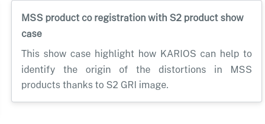

# About KARIOS website

The KARIOS website is built thanks to [**sphinx**](https://www.sphinx-doc.org/) and uses: 
- [`pydata_sphinx_theme`](https://pydata-sphinx-theme.readthedocs.io/) for theme
- [`myst_parser`](https://myst-parser.readthedocs.io/) extension for markdown support
- [`sphinx_design`](https://sphinx-design.readthedocs.io/) for grid and cards
- [`sphinxcontrib-images`](https://github.com/sphinx-contrib/images) extension for image directives

Some extensions of myst are used : 
- `fieldlist` for sphinx metadata field in Markdown
- `colon_fence` for sphinx_design grid in Markdown

Custom CSS are located in `source/_static/css/custom.css`

Most of the pages are written in Markdown, except the home page which is in reStructuredText..

Nevertheless, the pages written in Markdown may contain some reStructuredText directive written using [MyST directive syntax](https://myst-parser.readthedocs.io/en/latest/syntax/roles-and-directives.html#directives-a-block-level-extension-point).

> There is a workaround for https://github.com/pydata/pydata-sphinx-theme/issues/1662 to hide left sidebar on some pages in `source/conf.py`. See attribute `html_sidebars` in [`source/conf.py`](source/conf.py).

## Build the KARIOS website

### Pre-requisites

Install sphinx and dependencies in **your KARIOS conda environment**.

Your KARIOS conda environment **MUST** be activated.

From the `site` folder run : 

```console
conda install -n karios -c conda-forge --file requirements.txt
```

`make` command should be installed.

### Build command

To build the KARIOS website, open a Terminal and run the following command from `site` folder

```console
make clean && make html
```

The result is located in a folder named `build/html`

Open `build/html/index.html` in a web browser to see the result.

> **IMPORTANT**
> 
> :warning: Do not change `site/.gitignore`
> 
> :warning: Do not add/commit the `build` folder

## Deployment

The KARIOS website is automatically deployed to github pages : https://telespazio-tim.github.io/karios/

This is driven by the github workflow defined in [.github/workflows/site.yml](../.github/workflows/site.yml)

The deployment workflow is inspired by https://coderefinery.github.io/documentation/gh_workflow/

## Site structure and editing

### Home page

The home page main file is [`source/index.rst`](source/index.rst), and it is (the only one) witten in reStructuredText.

This file defines the structure of the home page by: 
- defining a few css styles
- including the banner image
- defining menu with toctree directive, to access to the other main sections of the KARIOS website
- including [`source/welcome.md`](source/welcome.md) that contains the rest of the content of the home page.

### Cookbook Section

#### Create a page in cookbook

Create a markdown file in the folder `source/cookbook`, example `my_page.md`, **with a first level title**.

The first level title is used by the `toctree` directive in the main cookbook section file `source/cookbook/index.md` (see [below](#update-cookbook-index)) in order to fill the section navigation of the Cookbook section of the site.

File content sample: 

```markdown
# First level title

here the content
```

Save the file.

> At this step, the page exists but not yet accessible, the next step allow to register the page in the cookbook index.

#### Update cookbook index

In the file `source/cookbook/index.md`, add the reference to this file in the `toctree` section by using the added **filename without extension** of the new created file.  
From the previous example, it should be `my_page`.

Save the file, and verify by regenerating the KARIOS website with `make clean && make html`.

> The first level title of the page appear in the "Section Navigation" in the left menu bar in the cookbook section of the site and the new page is available.

### Case studies section

#### Create a case study page

Create a markdown file in the folder `source/case_study`, example `my_new_case_study.md`, following this template: 

```markdown
(key)=

# First level TITLE

some content
```

Change `key` by something referencing the case study, example: `my_case`

> the key must be unique across all pages in the section

The first level title is used by the `toctree` directive in the main case studies section file `source/case_study/index.md` (see [bellow](#update-case-study-index)) in order to fill the section navigation of the Case studies section of the site.

Example

```markdown
(mss)=

# MSS Case Study

Here comes the content of the MSS Case Study with KARIOS
```

> At this step, the page exists but not yet accessible, the next step allow to register the page in the Case studies index.

#### Update case studies index

In the page `source/case_study/index.html`, add the reference to the newly created file in the `toctree` section by using the added **filename without extension**.  
From the previous example, it should be `my_new_case_study`.

Still in the page `source/case_study/index.html`, add a card in the grid after the last one (ended by `<!-- EO item XX -->`) by using the following template

```markdown
<!-- item XX+1 -->
::::{grid-item}
:::{card} Card Title
:link: <key>
:link-type: ref

Content of the card
:::
::::
<!-- EO item XX+1 -->
```

- Change `Card Title` by the tile to shows in the card header.
- Change `<key>` by using the same key used at the top of the new page (in this example it should by `my_case`).
- Update `Content of the card` by a quick summary of the case study.
- Update the commented lines `<!-- item XX+1 -->` and `<!-- EO item XX+1 -->` to highlight the start and the end of the grid item that represent the card.

Example with sample of previous paragraph: 

```markdown
<!-- item 4 -->
::::{grid-item}
:::{card} MSS product co registration with S2 product show case
:link: mss
:link-type: ref

This show case highlight how KARIOS can help to identify the origin of the distortions in MSS products thanks to S2 GRI image.

:::
::::
<!-- EO item 4 -->
```

Save changes and verify by regenerating the KARIOS website with `make clean && make html`.
Go to "Case Studies" section, you should see the new card and the first title of the new page in the "Section Navigation" in the left menu bar.

Card result sample:



You should be able to access to the new page by clicking on the card or the corresponding title in the "Section Navigation".
