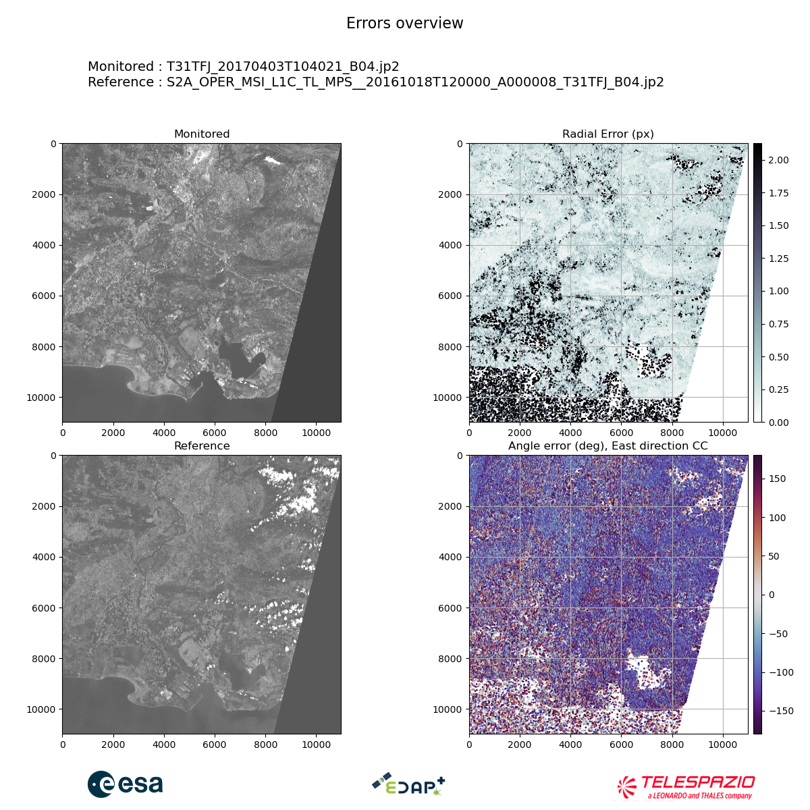
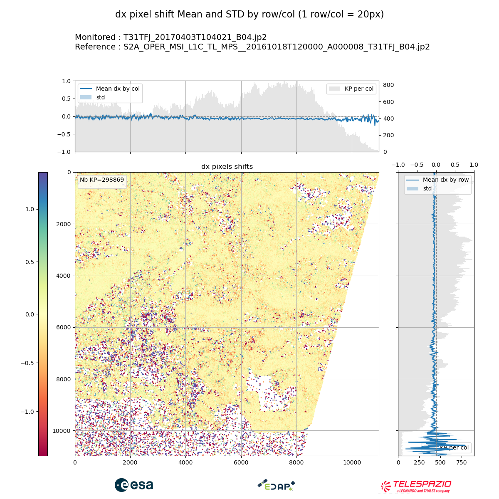
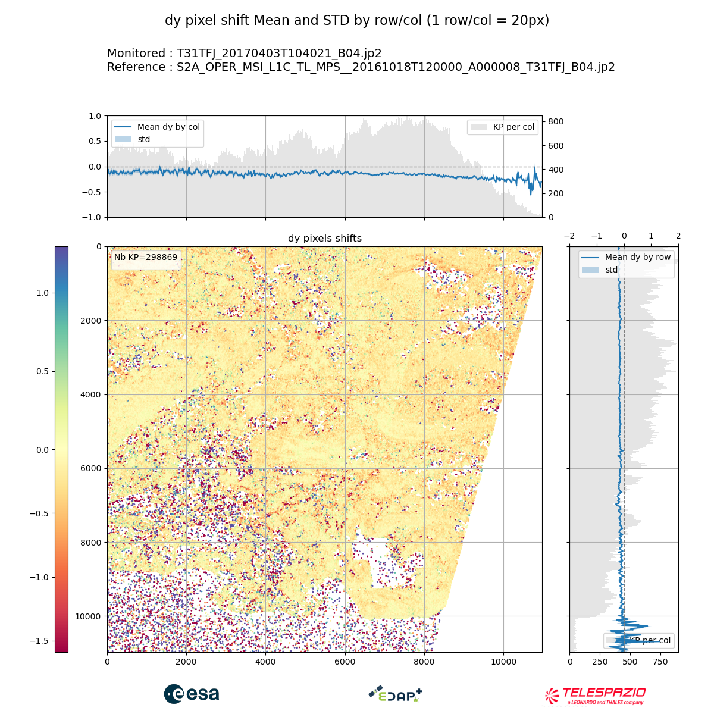
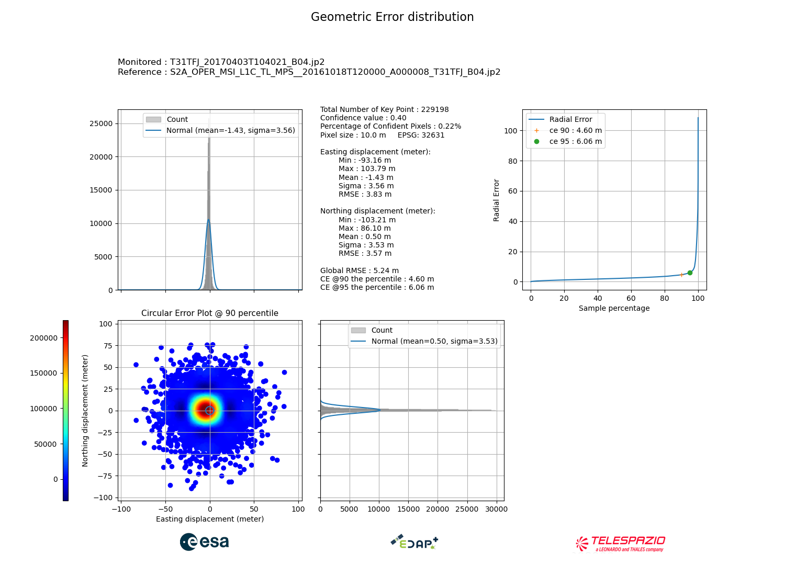
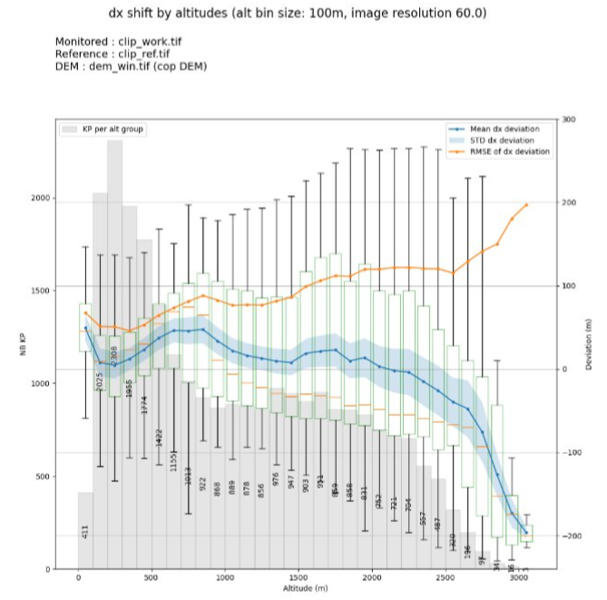
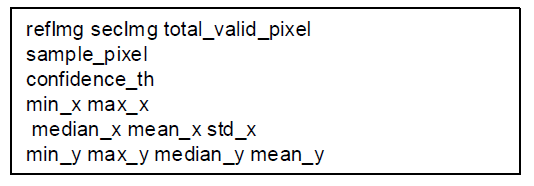
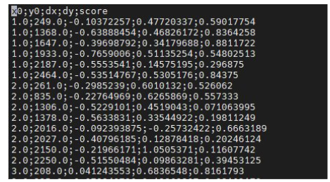
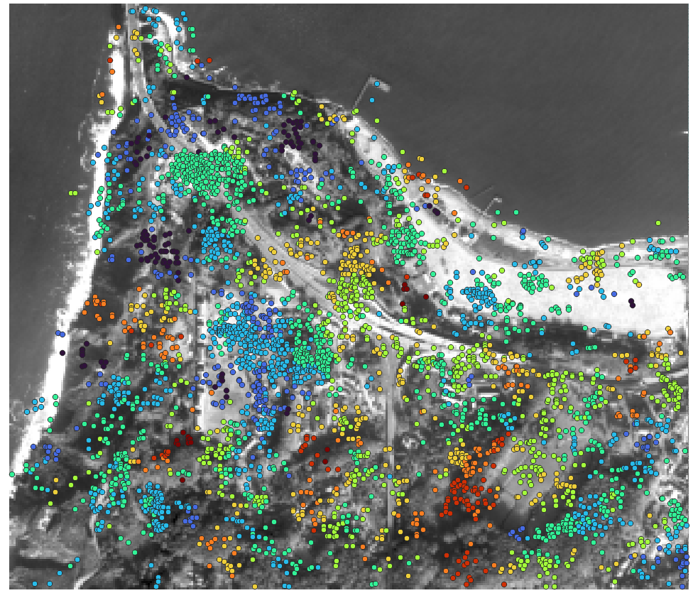

(output)=

# Understand KARIOS output data and plots

This section reviews all the outputs generated by KARIOS, including plots and intermediate products.

## 1. Plots 

### 1.1 Error overview maps

The error overview maps show the monitored image, reference on the left and the keypoints map on the right. For each point, the radial error in pixel (top) and the angle error (bottom) are displayed.



### 1.2 X/Y pixel shift by rows and columns

These outputs show the pixel shift mean and standard deviation by rows and columns, for both x and y directions.





### 1.3 Geometric Error Distribution

This output provides :

* The circular error graph that gives a global view on the pixel shift distribution and the geometric shift tendencies, as well as the histograms in both directions with mean/sigma values. 
* The global statistics: min, max, mean, STD, RMSE.
* The radial error plot with circular error (90%/95%).




### 1.4 Geometric shift by altitudes distribution

This output provides the evolution of the mean / STD / RMSE of the deviation against elevation values, groupped as bins. These plots are generated if the DEM is provided in the KARIOS command line (--dem) and contain :

* A plot for the dx deviation 
* A plot for the dy deviation
* A plot for radial error




## 2. Files

### 2.1 TXT File

This file contains all the global useful information to be easily extracted : 

* Monitored image name 
* Reference image name 
* Total number of valid pixels
* Pixel sampling
* Confidence threshold for accuracy analysis
* Min/max values in x/y
* Median/Mean/STD values in x/y



### 2.2 CSV File

This file contains for every detected corner :

* The x/y coordinates 
* The shift along x/y in meters
* The confidence score



### 2.3 Key points mask

This mask is a GeoTIFF file containing for each detected keypoint :

* dx/dy shift in pixel 
* Confidence score 
* Radial error
* Angle error
* ZNCC score if available

This file is also available as a JSON file that can be viewed on QGIS : 



### 2.4 Laplacian images

The Laplacian image is the 2D second derivative of the input images (monitored and reference) which is used in the KLT process as the basis to detect corners. It can be useful to examine these images to see if they are similar and comparable, as they are determinant for corners detection.

This output can be activated by using --generate-intermediate-product.

```{figure} lap_3m.png
:name: lap
:width: 600px

Computed laplacian - Skysat / USGS LiDAR at 3 meters
```

```{include} ../_includes/endnote.md


