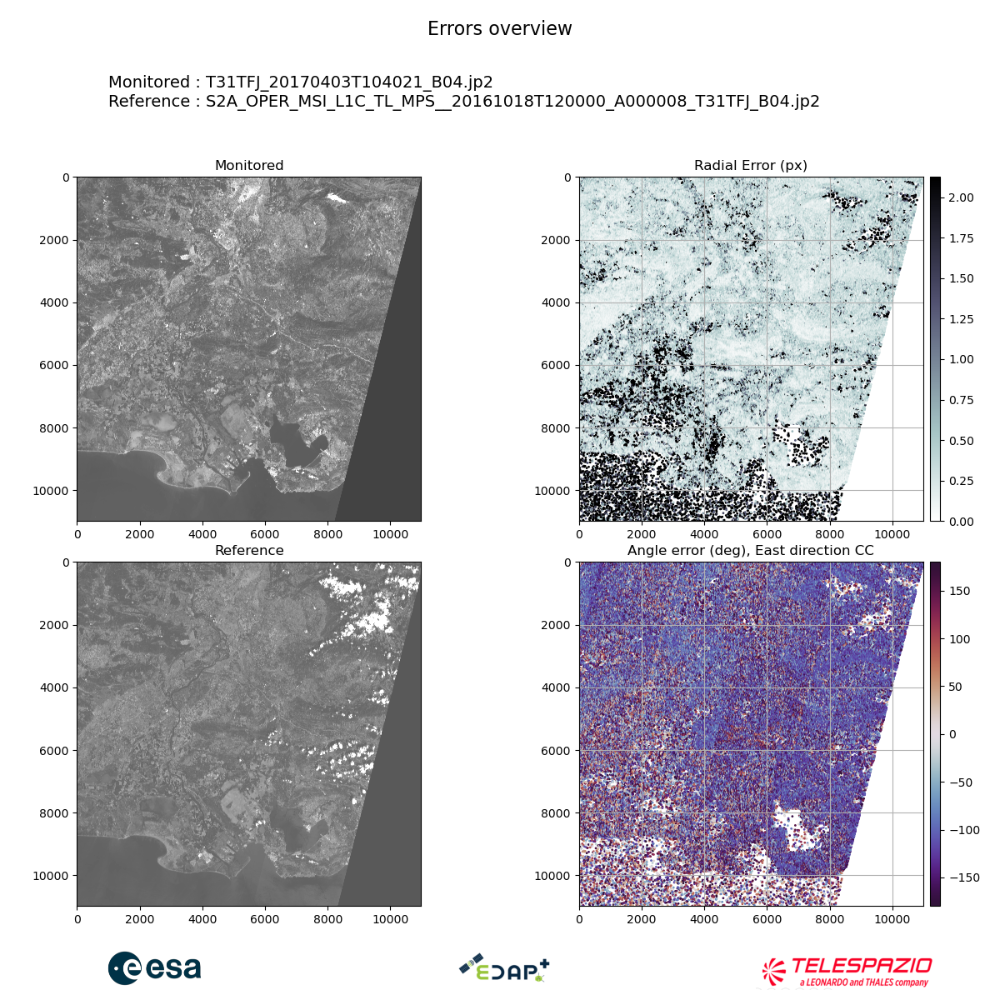
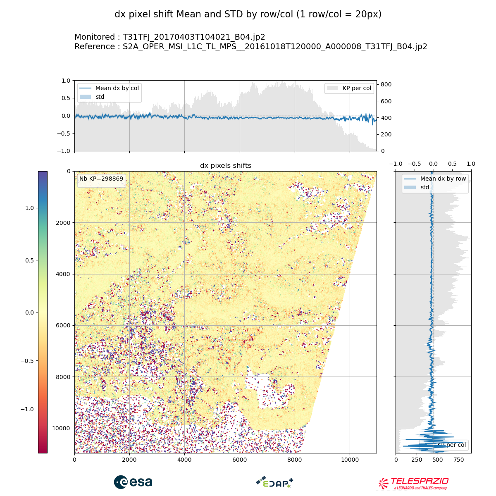
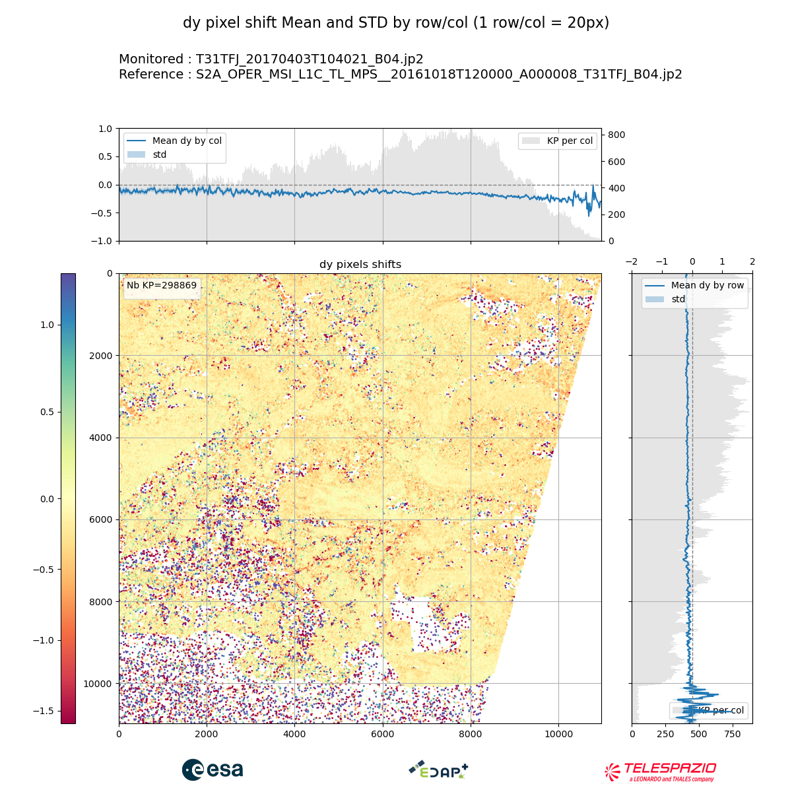
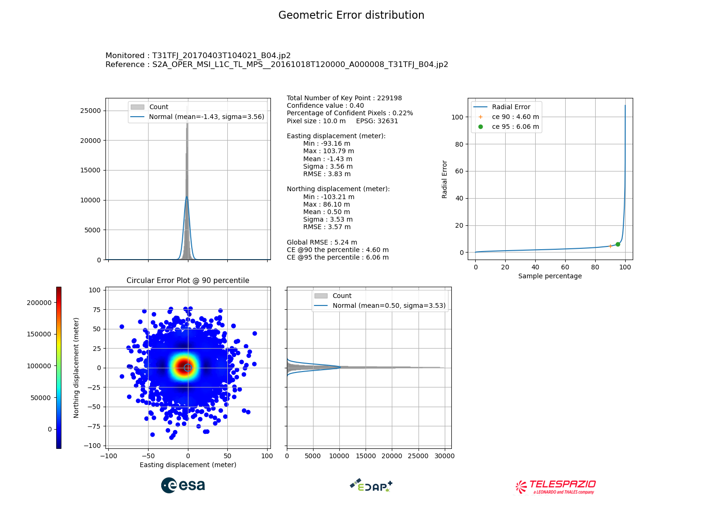

# Understand KARIOS outputs data and plots

```{todo}
Write intro
```

## Error overview maps

```{todo}
Write description
```

```{thumbnail} 01_overview.png
```



## X/Y pixel shift by rows and columns

```{todo}
Write description
```





## Geometric Error Distribution

```{todo}
Write description
```



## Files

```{todo}
Write description
```

### CSV File

### Key points mask
