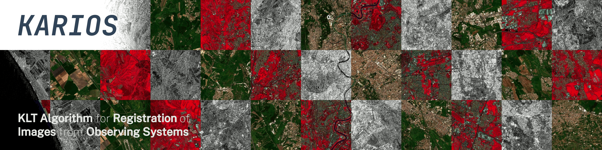

.. Karios documentation master file, created by
   sphinx-quickstart on Thu May 16 15:01:02 2024.
   You can adapt this file completely to your liking, but it should at least
   contain the root `toctree` directive.

.. disable right sidebar

:html_theme.sidebar_secondary.remove:

.. raw:: html

    

.. This title is not displayed due to custom css above (h1)

Welcome to Karios's documentation!
==================================

.. toctree::
   :hidden:
   :maxdepth: 1
   :caption: Contents:

   quickstart
   cookbook/index
   case_study/index
   references

.. raw:: html
   
     

.. include:: welcome.md
   :parser: myst_parser.sphinx_

.. Indices and tables
.. ==================

.. * :ref:`genindex`
.. * :ref:`modindex`
.. * :ref:`search`
